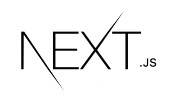
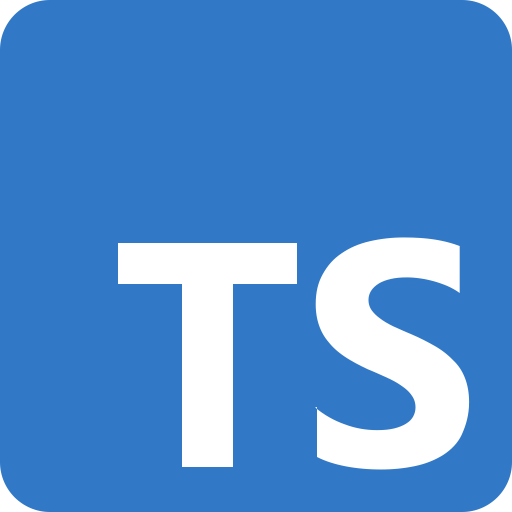
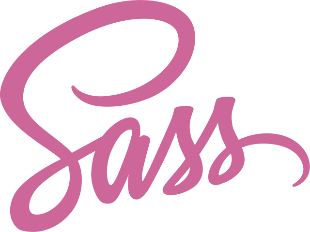
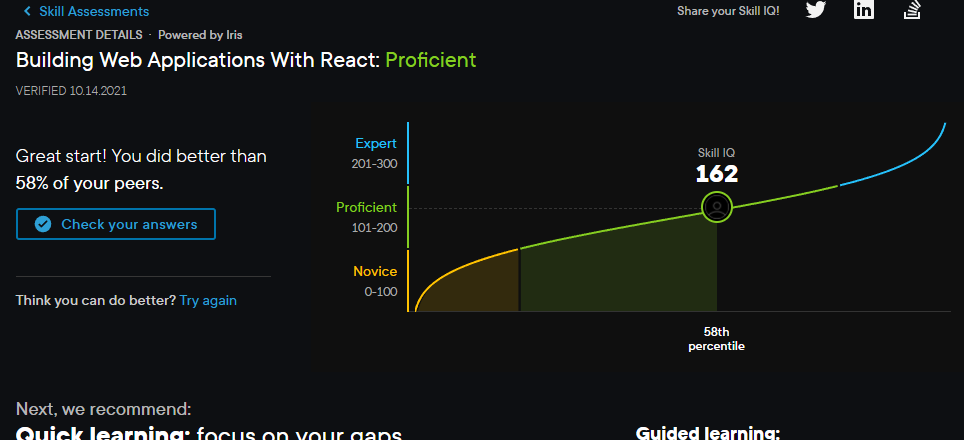

# Welcome

### :us: :es: :brazil:

#### :octocat: - My name is **Matheus Schiffer**. Studying and practicing **[React](https://www.reactjs.org),  [Next.js](https://nextjs.org/),  [TypeScript](https://www.typescriptlang.org/) and  [Sass](https://sass-lang.com/)** since january 2021.

#### :electron: - While looking for a job to gather experience, I'll be using https://mschiffer.com as a Portfolio, still under development.

#### :shipit: - In this short period of time (10 months) I've done better than 58% of my peers in the test 'Building Web Applications with React', with a score of 162/300.

####  
